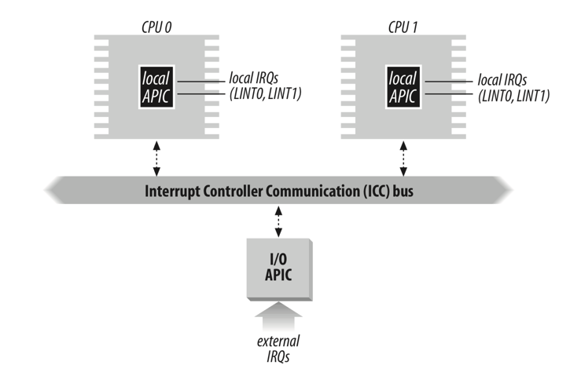

title: xv6: interrupts
category: operating systems

xv6中3种常见的中断机制：system call，exception，device notification。

基本的流程是中断当前的控制流，跳转执行kernel中预先设定的interrupt handler。

## 基础设施

### Interrupt descriptor

x86用特殊的数据结构interrupt descriptor来指示interrupt handler的入口（所以也称gate）。它的长度为64位，其中包括16位segment selector、32位offset，以及若干标志位（如下图所示）。标志位包括2位descriptor privilege level（DPL），4位gate type。



xv6中主要涉及了3种gate type：

- trap gate
- interrupt gate: similar to trap gate, but clear IF flag in the %eflags register to disable further interrupts
- task gate: its segment selector refers to task state segment 

系统通常预设一个包含若干entry的interrupt descriptor table（IDT）。x86用特殊的寄存器%idtr保存IDT的地址。%idtr为48位，其中32位保存IDT起始地址，16位保存IDT的长度。

xv6预设了包含了256个entry的IDT。查找interrupt handler的步骤如下：

1. 根据序号找到IDT中的相应entry，获得gate
2. 读取gate，获得其中的segment selector，以及指令起始位置offset
3. 根据segment selector去SDT中查找对应segment descriptor，获得segment base和segment limit
4. 如果gate中的offset在segment limit限定范围之内，则目标interrupt handler指令的起始地址为segment base+offset

### Privilege level

gate中有两处涉及权限控制：DPL标志位，以及segment selector的DPL。DPL标志位表示的是发起中断所必须的权限，而segment selector的DPL是interrupt handler执行时的权限。二者可以不同。xv6中所有interrupt handler都需要在kernel mode下执行，于是segment selector的DPL都为0。

在开始中断之前，首先比较当前指令的权限（CPL，即当前%cs所指示的segment descriptor中的DPL）和gate中的DPL标志位。由于privilege level取值越小表示权限越高。所以只有当CPL&le;DPL时，目前的控制流才有足够权限发起指定中断。

如果发起中断时CPL处在user mode中，而所有interrupt handler都需要在kernel mode中运行，这就涉及到权限提升的问题。其中包括将程序所使用的栈从user stack切换到kernel stack。xv6用一个特殊的数据结构tast state segment（TSS）保存kernel stack的地址。

### Task state segment

在进程初始化的过程中，xv6首先创建了一个特殊的数据结构`taskstate`，其中保存了进程kernel stack的地址（%ss和%esp）：

```c
// mmu.h
struct taskstate {
  ...
  uint esp0;         // stack pointers and 
  ushort ss0;        // segment selectors after switching to kernel mode
  ...
}    
```

与此相应，在GDT中加入新的一行`SEG_TSS`，用以保存一个指向上述`taskstate`的segment descriptor。一个特殊的task register（%tr）用来保存`SEG_TSS`的地址。以上过程在`switchuvm`函数中：

```c
// vm.c
void switchuvm(struct proc *p) {
  ...
  cpu->gdt[SEG_TSS] = SEG16(STS_T32A, &cpu->ts, sizeof(cpu->ts)-1, 0);
  cpu->gdt[SEG_TSS].s = 0;
  cpu->ts.ss0 = SEG_KDATA << 3;                    # stack segment
  cpu->ts.esp0 = (uint)proc->kstack + KSTACKSIZE;  # kernel stack 
  ...
  ltr(SEG_TSS << 3);                               # 将segment selector载入%tr中
  ...
}
```

### instructions

- int n

`int`指令接受一个参数n，用于指示IDT中的第n个gate。

`int`指令的执行流程就是否涉及权限改变分两种情况。当中断不涉及权限改变时（中断之前已经运行在kernel mode中，在xv6中对应trap/interrupt gate），interrupt handler在执行时可以直接使用当前进程的kernel stack：

1. 将%eflags、%cs，%eip（确切来说应当是%eip+sizeof(int instruction)）压栈。%cs和%eip组成了中断返回之后的指令位置，即far call指令中的return addresss
2. 将错误码`err`压栈
3. 将interrupt handler对应的segment selector和指令位置分别载入%cs、%eip
4. 如果是interrupt gate，将%eflags中IF标志位置零
5. 跳转，开始执行interrupt handler

另一种情况下中断涉及权限提升。xv6中执行system call时就涉及到这个情况：CPL和DPL均为3，但interrupt handler要求DPL为0。这种情况下首先需要权限提升，将进程使用的栈从user stack切换到kernel stack，切换过程如下：

1. 首先将%ss和%esp（user stack的地址）备份在CPU内部寄存器中
2. 读取`taskstate`中的%ss和%esp载入CPU。此后进程不再使用user stack，转而使用kernel stack
3. 将步骤1中备份的%ss、%esp保持到kernel stack上

此时系统进入kernel mode，此后中断的执行过程与不涉及权限改变的情况相同。

- iret

`iret`之于`int`类似`ret`之于`call`，具体的操作是从栈上还原%eip、%cs和%eflags（如果涉及权限改变，还需要还原%ss和%esp），继续中断之前的流程。

### trap frame

与函数调用时用frame来管理寄存器状态的想法类似，xv6在执行中断时也引入了trap frame的概念。trap frame是kernel stack中分出的一段区域，它保存着进入中断之前各个寄存器的状态。从中断返回之后，系统需要将trap frame中保存的状态还原到各个寄存器中，以继续中断之前的控制流。

```c
struct trapframe {
  // registers as pushed by pusha
  uint edi;
  uint esi;
  uint ebp;
  uint ebx;
  uint edx;
  uint ecx;
  uint eax;

  // rest of trap frame
  ushort gs;
  ushort fs;
  ushort es;
  ushort ds;

  uint trapno;

  // below here defined by x86 hardware
  uint err;
  uint eip;
  ushort cs;
  uint eflags;

  // below here only when crossing rings, such as from user to kernel
  uint esp;
  ushort ss;
}
```

## Interrupt handler

### trap vectors

xv6中interrupt handler指令的地址保存在trap vector数组`vectors`中（定义在vector.S，通过脚本vectors.pl生成）。第i个trap vector（`vectors[i]`）即指向第i个interrupt handler的入口：

```assembly
vectori:
  pushl $0  # errer code, trapframe.err
  pushl $i  # trap no, trapframe.trapno
  jmp alltraps
```

所有`vector[i]`最终跳转到`alltraps`，`alltraps`创建trap frame然后调用处理各种中断的`trap`函数：

- 创建trap frame：将除了%cs、%ss之外所有的segment register和所有general purpose registe的内容压栈。%cs和%ss在执行`int`指令的过程中处理。
- 载入data segment和per-cpu segment
- 调用`trap`函数。之前创建的trap frame是`trap`函数的参数。

```assembly
# trapasm.S
.globl alltraps
alltraps:
  # Build trap frame.
  pushl %ds
  pushl %es
  pushl %fs
  pushl %gs
  pushal    # push all general purpose registers
  
  # Set up data and per-cpu segments.
  movw $(SEG_KDATA<<3), %ax
  movw %ax, %ds
  movw %ax, %es
  movw $(SEG_KCPU<<3), %ax
  movw %ax, %fs
  movw %ax, %gs

  # Call trap(tf), where tf=%esp
  pushl %esp     # trap frame处于当前栈的端，即%esp指向的地址，故此处将%esp压栈作为trap的参数。
  call trap
  addl $4, %esp  # 从栈上弹出参数，`trap`函数结束
```

与`alltrap`镜像对称，xv6用`trapret`来处理从中断返回的过程：

```assembly
trapret:
  popal
  popl %gs
  popl %fs
  popl %es
  popl %ds
  addl $0x8, %esp  # trapno and errcode
  iret
```

总结来说，中断流程中内存状态的演变过程大致如下：

- 进程通过指令`int`进入中断，如果涉及从user stack到kernel stack的切换，`int`将首先备份user stack对应的%ss和%esp，从`taskstate`中读取kernel stack对应的%ss和%esp。此后使用kernel stack。
- 将当前控制流的%elags、%cs、%eip压栈
- 根据`trapno`从`idt`中查找相应的gate，进行权限验证，如果验证通过，将gate中记录的interrupt handler指令的地址载入%cs和%eip中，并设置%eflags
- 将`err`和`trapno`序号压栈
- 通过`alltraps`建立trap frame，将%ds、%es、%fs、%gs以及所有通用寄器压栈。将trap frame地址%esp压栈作为`trap`函数的参数
- 调用`trap`函数
- 从`trap`函数返回后，从栈上弹出参数
- 通过`trapret`，将执行trap之前通用寄存器和%ds、%es、%fs、%gs的内容从栈上弹出，恢复到各自的位置。从栈上弹出err code和gate序号。
- 执行`iret`，恢复%elags、%cs、%eip，如果涉及权限恢复，还需要还原%ss和%esp

### initialization

xv6创建了一个包含256个entry的IDT`gatedesc`。`tvinit`函数遍历`vectors`，为各个trap vector创建interrupt descriptor，并依次将它们载入IDT中。

```c
// mmu.h
// - istrap: 1 for a trap (= exception) gate, 0 for an interrupt gate.
//   interrupt gate clears FL_IF, trap gate leaves FL_IF alone
// - sel: Code segment selector for interrupt/trap handler
// - off: Offset in code segment for interrupt/trap handler
// - dpl: Descriptor Privilege Level: the privilege level required to invoke this gate
#define SETGATE(gate, istrap, sel, off, d) {...} 

// trap.c
struct gatedesc idt[256];
extern uint vectors[];  // in vectors.S: array of 256 entry pointers

void tvinit(void) {
  int i;
  for(i = 0; i < 256; i++)
    SETGATE(idt[i], 0, SEG_KCODE<<3, vectors[i], 0);
  SETGATE(idt[T_SYSCALL], 1, SEG_KCODE<<3, vectors[T_SYSCALL], DPL_USER);  // T_SYSCALL = 0x40
  ...
}
```

其中比较特殊的是`idt[T_SYSCALL]`，这是唯一一个允许从user mode中直接发起的中断，对应的是用户程序向kernel发起system call。

## System call

中断的一种机制是程序发起system call。xv6中某些操作，比如读写硬盘、申请新的内存空间等，必须在kernel mode下进行，运行在user mode下的用户程序没有操作的权限。当用户程序需要进行这些操作时，xv6的办法是由kernel提供一些system call，用户程序通过IDT中的特殊gate，`T_SYSCALL`发起中断。`T_SYSCALL`允许user mode下的调用，在执行`int`指令的过程中进行提权进入kernel mode，由kenrel执行指定的system call。

### call stack

xv6预设了一个系统函数表`syscalls`，将syscall number对应到具体的kernel中定义函数（函数体在sysproc.c、sysfile.c等文件中）：

```c
// syscall.c
static int (*syscalls[])(void) = {
[SYS_fork]    sys_fork,  // SYS_fork = 1
...
[SYS_close]   sys_close, // SYS_close = 21
};
```

但是这些函数只能在kernel mode中运行（kenrel code所处的内存分页`PTE_U`为0），用户程序不能直接调用。

为给用户程序提供入口，xv6提供了一个头文件user.h中，其中声明了一系列system call：

```c
// system calls
int fork(void);
int exit(void) __attribute__((noreturn));
int wait(void);
int pipe(int*);
int write(int, void*, int);
int read(int, void*, int);
int close(int);
int kill(int);
int exec(char*, char**);
int open(char*, int);
int mknod(char*, short, short);
int unlink(char*);
int fstat(int fd, struct stat*);
int link(char*, char*);
int mkdir(char*);
int chdir(char*);
int dup(int);
int getpid(void);
char* sbrk(int);
int sleep(int);
int uptime(void);
```

用户程序只要include这个user.h，就可以像调用库函数一样调用这些system call。这些函数的定义在usys.S中：

```c
// usys.S
#define SYSCALL(name) \
  .globl name; \
  name: \
    movl $SYS_ ## name, %eax; \
    int $T_SYSCALL; \
    ret
    
SYSCALL(fork)
...
```

以下以`fork`为例。在定义`fork`函数时，宏`SYSCALL`将相应的序号保存在%eax中（`fork`对应到序号为`SYS_fork`），然后执行`int`指令进入IDT中序号为`T_SYSCALL`的gate。如前所述，控制流会跳转到trap vector中的相应entry，通过`alltraps`建立trap frame，然后调用`trap`函数：

```c
// trap.c
void trap(struct trapframe *tf) {
  if(tf->trapno == T_SYSCALL){
    ...
    proc->tf = tf;  // proc定义在proc.h中，是一个per-CPU变量
    syscall();
    ...
    return;
  }
  ...
}
```

`trap`函数读取trap frame，检查`trapno`，进入`syscall`函数：

```c
// syscall.c
void syscall(void) {
  int num;
  
  num = proc->tf->eax;
  if(num > 0 && num < NELEM(syscalls) && syscalls[num]) {
    proc->tf->eax = syscalls[num]();
  } else {
    ...
    proc->tf->eax = -1;
  }
}
```

`syscall`从trap frame的%eax中读取指定的序号，然后从系统函数表`syscalls`中查找相应的函数。`SYS_fork`对应的是`sys_fork`函数：

```c
int sys_fork(void) {
  return fork();
}
```

至此控制流从用户程序发起的system call`fork`到了kernel中定义的实际负责创建新进程的函数`fork`。

### 一个栗子：shell

```c
// sh.c
#include "user.h"
...

int main(void) {
  ...
  // Read and run input commands.
  while(getcmd(buf, sizeof(buf)) >= 0){
    ...
    if(fork1() == 0)
      runcmd(parsecmd(buf));
    wait();
  }
  exit();
}

int fork1(void) {
  int pid;

  pid = fork();
  if(pid == -1)
    panic("fork");
  return pid;
}
```

shell从输入中得到一个命令之后，会从当前进程`fork`出一个子进程，然后在子进程中执行收到的命令。当前进程执行`wait`直至子进程返回。`fork`、`wait`都是system call。它们的申明在user.h中。

## Device interrupt

除了system call之外，另一种重要的中断机制是device interrupt。当母板上的各种硬件（计时器、硬盘、网卡直至键盘、鼠标等待）需要与CPU交互时，它们产生一个中断信号发送给CPU。

在CPU一方，它可以选择是否接受硬件发来中断的中断信号。x86中%eflags寄存器保存了与CPU状态相关的若干标志位，其中包括一个是否接受中断消息的标志位`IF`。指令`cli`将`IF`置零，停止接受中断，与之相反指令`sti`开启中断。

---
#### 参考
1. [UCI course on interrupt](https://www.ics.uci.edu/~aburtsev/143A/lectures/lecture09-interrupts/lecture09-interrupts.pdf)
2. [xv6 Book](https://pdos.csail.mit.edu/6.828/2012/xv6/book-rev7.pdf)
